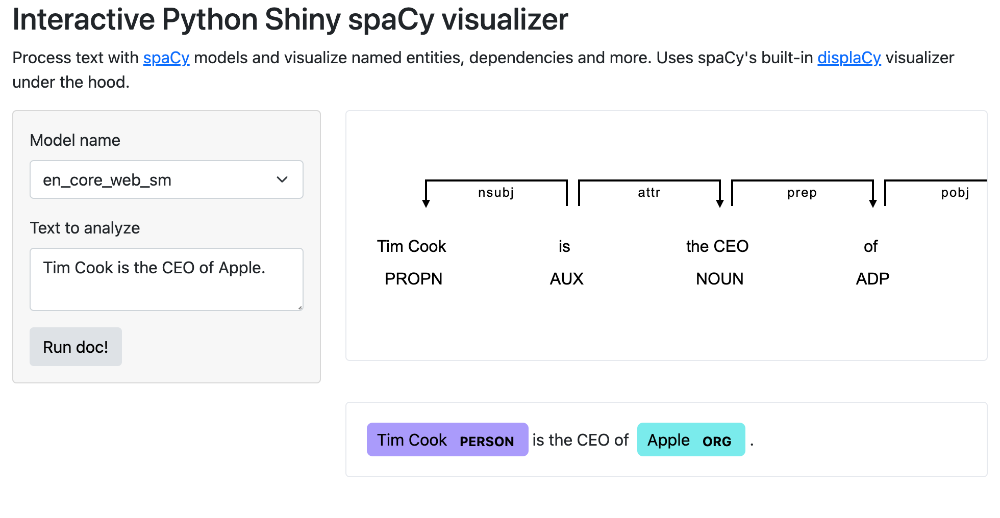

# Getting Started



Demo: <https://ryanwesslen.shinyapps.io/spacy-shiny/>

## Installation instructions

Create a new virtual environment.

```bash
python -m venv venv
source venv/bin/activate
```

Install packages.

```bash
pip install --upgrade pip wheel
pip install -r requirements.txt
```

## Run shiny project

Run the python shiny app.

```bash
shiny run --reload 
```

## Deploy to shinyapps.io

First install `requirements-dev.txt`.

```bash
pip install -r requirements-dev.txt
```

Then follow [these instructions to authenticate](https://docs.rstudio.com/shinyapps.io/getting-started.html#working-with-shiny-for-python).